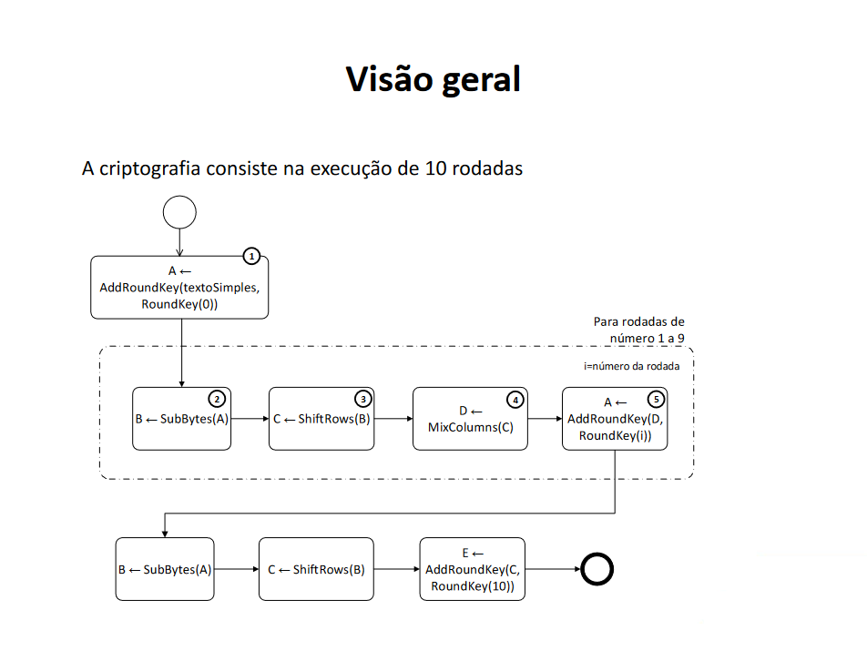
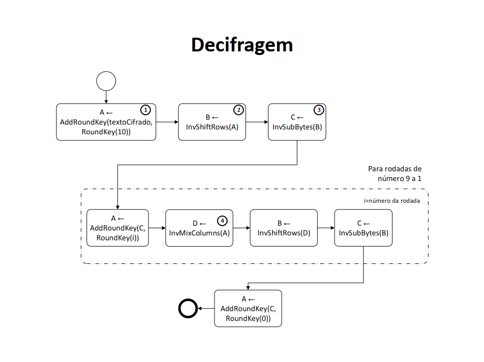

# Criptografia AES em Java

Este algoritmo foi desenvolvido por mim como uma solução para um trabalho da faculdade. Ele implementa o Advanced Encryption Standard em Java sem o auxílio de bibliotecas externas.

Para o propósito de testes e comparação, este repositório inclui o mesmo algoritmo usando a biblioteca Cipher. 

## Pipeline da cifragem

## Pipeline da decifragem

